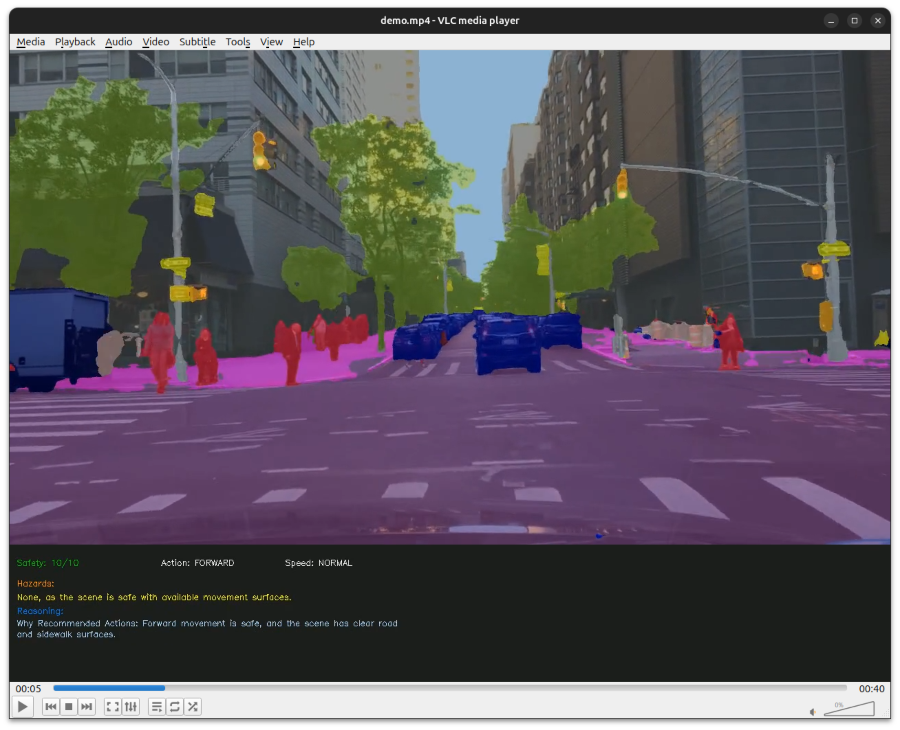

# Cityscape Scene Semantic Understanding for Driving Assistant

## Project Overview

This project implements a semantic scene understanding pipeline for autonomous driving assistance using the SegFormer model. It performs semantic segmentation on cityscape images and videos, analyzes spatial relationships between detected objects, and generates natural language scene descriptions suitable for large language models (LLMs). The system can recommend movement decisions (such as direction, speed, and hazard avoidance) based on real-time visual input.

### Key Features

- **Semantic Segmentation:** Uses a pretrained SegFormer model to segment cityscape scenes into classes such as road, sidewalk, car, person, building, etc.
- **Scene Analysis:** Extracts spatial and size information for each detected object, providing context-aware scene descriptions.
- **LLM Integration:** Generates structured prompts for LLMs to recommend safe navigation actions based on the current scene.
- **Video Processing:** Processes video files frame-by-frame, annotating each frame with movement decisions and safety assessments.
- **Visualization:** Overlays segmentation masks and decision annotations on images and videos for easy interpretation.

## Example Output

Below is an example of the system's output on a sample driving video. The video is processed to show semantic segmentation and annotated movement decisions for each frame.

Demo video can be viewed on [Youtube](https://www.youtube.com/watch?v=dK-Rmfju8zg)
[](https://www.youtube.com/watch?v=dK-Rmfju8zg)

## Getting Started

1. **Environment Setup:**  

   1.1 Install dependencies using the provided `environment.yml` with Conda
   
   1.2 Install ollama and serve LLM model "qwen3:0.6b"
   ```
    ollama run qwen3:0.6b
   ```

2. **Run Segmentation or Video Processing:**

    Use the scripts in `SegFormerApp/main.py` to process images or videos.

3. **Customization:**

    Place your input images in the images/ directory.
    Place your input videos in the videos/ directory.